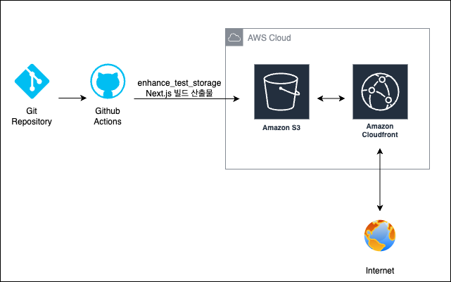
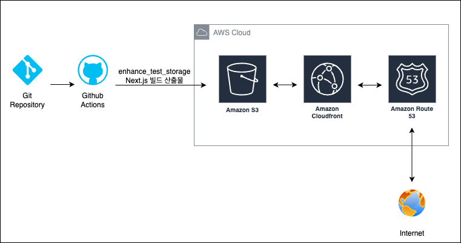

# frontend_3rd_chapter4-1

## 프론트엔드 배포 파이프라인

1. S3 버킷 - CloudFront 배포 연동


2. Github Actions Workflow 적용



3. 상용 프로젝트 시 예상



### 개요

GitHub Actions에 워크플로우를 작성해 다음과 같이 배포가 진행되도록 합니다.

1. 저장소를 체크아웃합니다.
2. Node.js 18.x 버전을 설정합니다.
3. 프로젝트 의존성을 설치합니다.
4. Next.js 프로젝트를 빌드합니다.
5. AWS 자격 증명을 구성합니다.
6. 빌드된 파일을 S3 버킷에 동기화합니다.
7. CloudFront 캐시를 무효화합니다.

## 주요 링크

- S3 버킷 웹사이트 엔드포인트: [http://perf-test-storage-kr.s3-website-us-east-1.amazonaws.com](http://perf-test-storage-kr.s3-website-us-east-1.amazonaws.com)
- CloudFrount 배포 도메인 이름: [https://d1gla729o7cw8i.cloudfront.net](https://d1gla729o7cw8i.cloudfront.net)

## 실습 절차

### S3 버킷 생성 및 CloudFront 배포 연동

1. `enhance-test-storage`라는 `Next.js` 어플리케이션을 생성하였습니다.
2. Next.js 어플리케이션을 S3에 업로드하였습니다.
	- S3 버킷 웹사이트 엔드포인트: `http://perf-test-storage-kr.s3-website-us-east-1.amazonaws.com`
3. S3 버킷과 CloudFront 배포를 연동하였습니다.
	- CloudFront 배포 도메인 이름: `https://d1gla729o7cw8i.cloudfront.net`

4. 매뉴얼대로 CloudFront에 배포하였으나 `Content-Encoding` 이 Response Header 에 없어 `compression 설정` 을 추가해주었습니다.
  ```typescript
  import type { NextConfig } from "next";
  const nextConfig: NextConfig = {
    /* config options here */
    output: 'export',
    compress: true // compression 설정 추가 - 자동 압축 활성화
  };
    
  export default nextConfig;
  ```

### IAM 정책 및 사용자 생성

1. IAM 정책 및 사용자를 생성하였습니다.
	- 정책 이름
	- 사용자 이름
	- 콘솔 로그인 URL
	- 콘솔 암호
2. IAM 사용자키를 발급받았습니다.
	- 액세스 키
	- 비밀 액세스 키

### Github Action Workflow 생성

1. github repository를 publish 합니다.
2. publish 된 repository 에 secrets and variables를 추가해줍니다.
3. github actions workflow 파일을 생성합니다. workflow 구성은 아래와 같습니다.
	1. **트리거 조건**
		- main 브랜치에 push 발생 시
		- 수동 실행 가능 (workflow_dispatch)
	2. **실행 단계**
		1. 코드 체크아웃
		    - actions/checkout@v2 사용
		2. 프로젝트 빌드
		    - `npm ci`: 의존성 설치
		    - `npm run build`: Next.js 프로젝트 빌드
		3. AWS 인증 설정
		    - aws-actions/configure-aws-credentials 사용
		    - AWS_ACCESS_KEY_ID, AWS_SECRET_ACCESS_KEY, AWS_REGION 시크릿 사용
		4. S3 배포
		    - `out/` 디렉토리를 S3 버킷에 동기화
		    - `--delete` 옵션: 버킷의 기존 파일 중 로컬에 없는 파일 삭제
		5. CloudFront 캐시 무효화
		    - 모든 경로("/*")에 대한 캐시 무효화
		    - CLOUDFRONT_DISTRIBUTION_ID 시크릿 사용

4. Node.js 18.x 버전 설정 단계가 현재 workflow 파일에 누락되어 있어 추가하였습니다.
  ```yml
  - name: Setup Node.js
    uses: actions/setup-node@v3
    with:
      node-version: '18.x'
  ```

5. GitHub Actions에 작성된 워크플로우는 다음과 같이 배포가 진행되도록 합니다.
	1. 저장소를 체크아웃합니다.
	2. Node.js 18.x 버전을 설정합니다.
	3. 프로젝트 의존성을 설치합니다.
	4. Next.js 프로젝트를 빌드합니다.
	5. AWS 자격 증명을 구성합니다.
	6. 빌드된 파일을 S3 버킷에 동기화합니다.
	7. CloudFront 캐시를 무효화합니다.

## 주요 개념

### GitHub Actions과 CI/CD 도구

#### Github Actions

`GitHub Actions` 는 `GitHub`에서 제공하는 자동화된 워크플로우 실행 도구로, 코드 변경사항에 대한 자동 테스트, 빌드, 배포를 수행합니다.

수동 배포 과정을 자동화할 수 있어 인적 오류 가능성을 낮추고 일관된 배포 프로세스를 보장할 수 있어 많은 개발자들이 사용하고 있습니다.

빠른 개발-배포 주기를 실현할 수 있고 배포 과정의 투명성과 추적성을 확보할 수 있다는 이점이 있어 팀 생산성을 향상시킬 수 있습니다.

#### CI/CD 도구

1. 개념

    - CI

      `CI` 는 지속적인 통합(Continuous Integration)의 약자로 개발자들이 코드 변경사항을 자주 병합하는 프로세스를 말합니다.

      자동화된 빌드 및 테스트로 품질을 보장하며 통합 과정에서 발생하는 문제를 조기에 발견할 수 있습니다.

    - CD

      `CD`는 지속적인 배포 준비(Continuous Delivery) 혹은 지속적 배포(Continuous Deployment)의 약자입니다.

      신속하고 안정적인 소프트웨어 제공을 목표로 합니다.

2. 도구

    - 주요 CI/CD 도구로는 `Github Actions`, `Jenkins`, `Gitlab CI` 등이 있습니다.

3. CI/CD 파이프라인 주요 단계
    1. 소스 코드 관리
        - 버전 관리
        - 브랜치 전략
        - 코드 리뷰
    2. 빌드 자동화
        - 코드 컴파일
        - 의존성 관리
        - 아티팩트 생성
    3. 테스트 자동화
        - 단위 테스트
        - 통합 테스트
        - E2E 테스트
        - 성능 테스트
    4. 배포 자동화
        - 환경 구성
        - 배포 전략 (Blue-Green, Canary 등)
        - 롤백 메커니즘

4. 장점
    - 반복 작업을 자동화하고 신속한 피드백이 가능하여 협업 효율성, 개발 생산성을 향상시킬 수 있습니다.
    - 일관된 빌드/테슽 환경이 보장되고 버그를 조기에 발견해 품질을 향상시킬 수 있습니다.
    - 작은 단위의 변경 내용에 대한 적용 및 검증을 자동화하여 안정적으로 배포하므로 위험을 예방할 수 있습니다.
    - 수동 작업이 감소하고 오류 처리 비용을 절감할 수 있습니다.

### S3와 스토리지

#### S3

`S3`는 `AWS`에서 제공하는 확장가능 객체 스토리지 서비스로 정적 웹사이트 호스팅을 가능하게 합니다.

정적 웹사이트 호스팅에 최적화되어 있으며 비용이 효율적인 스토리지 솔루션으로 높은 가용성과 내구성이 장점입니다.

스토리지 용량이 거의 무제한에 가깝고 안정적인 파일 서비스를 제공하며 다른 AWS 서비스와의 통합 사용이 쉬운 것으로 유명합니다.

#### 스토리지

`스토리지`는 데이터를 저장하고 보존하는 물리적 또는 가상의 저장 공간을 말합니다. 데이터를 지속적으로 보관할 수 있으며 필요 시 접근/검색을 가능하게 합니다.

스토리지의 주요 유형으로는 `블록 스토리지`, `파일 스토리지`, `객체 스토리지`가 있습니다.

1. 블록 스토리지(Block Storage)
    - 데이터를 고정된 크기의 블록으로 나누어 저장 형태의 스토리지입니다.
    - 높은 성능과 낮은 지연시간이 특징이며 운영체제가 직접 접근 가능합니다.
    - 데이터베이스나 가상 머신에 적합합니다.
    - 대표적인 블록 스토리지로 `AWS EBS(Elastic Block Store)`가 있습니다.
2. 파일 스토리지(File Storage)
    - 계층적 디렉토리 구조로 데이터를 파일 형태로 저장합니다.
    - 사용자에가 친숙한 파일/폴더 구조로 되어 있습니다.
    - 여러 사용자가 동시에 접근이 가능하여 공유 드라이브로 활용하는 데 적합합니다.
    - 대표적으로 `AWS EFS(Elastic File System)`이 있습니다.
3. 객체 스토리지(Object Storage)
    - 데이터를 객체 단위로 저장하며 각 객체는 고유한 식별자를 가집니다.
    - 무제한에 가까운 확장성을 가집니다.
    - HTTP/HTTP를 통해 접근하고 메타 데이터 관리에 용이합니다.
    - 대표적으로 `AWS S3(Simple Storage Service)`가 있습니다.

클라우드 스토리지를 사용 시 `확장성`, `안정성`, `접근성`, `비용 효율성`에 이점이 있습니다.

1. 확장성
    - 필요에 따라 용량 조절이 가능하고 리소스를 탄력적으로 관리할 수 있습니다.
2. 안정성
    - 데이터 복제 및 재해 복구에 용이하고 높은 내구성을 갖습니다.
3. 접근성
    - 언제 어디서나 접근이 가능하고 다양한 디바이스를 지원합니다. API를 통한 프로그래밍 방식 접근도 가능합니다.
4. 비용 효율성
    - 사용한 만큼 비용을 지불하여 하드웨어 구매/관리 비용을 절감하고 운영 비용을 최적화할 수 있습니다.

### CloudFront와 CDN

#### CloudFront

`CloudFront`는 `AWS`에서 제공하는 CDN 서비스로 전 세계 엣지 로케이션을 통해 콘텐츠를 제공합니다.

글로벌 사용자에게 빠른 콘텐츠를 전달할 수 있고 원본 서버의 부하를 감소시키며 HTTPS 보안을 제공합니다.

CloudFront를 사용함으로서 웹사이트 로딩 속도 및 보안성이 향상되고 트래픽 비용을 낮출 수 있습니다.

#### CDN

`CDN`은 콘텐츠 전송 네트워크(Contents Delivery Nework)로 지리적으로 분산된 서버 네트워크를 통해 콘텐츠를 전달하는 시스템입니다. 원본 서버의 콘텐츠를 전 세계 각지의 엣지 서버에 캐싱하여 제공합니다. 사용자와 가까운 위치에서 콘텐츠를 전송하기 때문에 속도가 빠릅니다.

`CDN`의 주요 구성 요소로는 `엣지 로케이션`, `오리진 서버`, `캐싱 메커니즘`이 있습니다

1. 엣지 로케이션 (Edge Location)
    - 전 세계에 분산된 캐시 서버들을 지칭합니다.
    - 사용자와 가장 가까운 위치에서 콘텐츠를 제공하며 지연 시간을 최소화합니다.
2. 오리진 서버(Origin Server)
    - 원본 콘텐츠가 저장된 서버입니다.
    - 엣지 서버가 콘텐츠를 가져오는 원천이며 웹 서버, 애플리케이션 서버, 스토리지 등이 될 수 있습니다.
3. 캐싱 메커니즘
    - 콘텐츠 캐싱 정책입니다.
    - TTL(Time To Live), 캐시 무효화 방법 등을 설정하고 관리합니다.

`CDN` 은 주로 콘텐츠 전송 최적화, 보안, 성닝 최적화 기능을 제공합니다.

1. 콘텐츠 전송 최적화
    - 경로, 프로토콜을 최적화합니다.
    - 파일을 압축하여 제공하고 HTTP/2, HTTP/3을 지원합니다.
2. 보안 기능
    - WAF(Web Application Firewall)를 제공하고 DDoS 방어가 가능합니다.
    - SSL/TLS 인증서를 관리가 가능합니다.
3. 성능 최적화
    - 자동 파일 압축 기능을 제공하고 이미지 최적화, 미니피케이션, 브라우저 캐싱 제어가 가능합니다.

`CDN`을 이용함으로써 페이지 로드 시간을 단축할 수 있고, 대기 시간이 감소될 수 있습니다. 대역폭 사용이 최적화되고 서버 부하를 분산시켜 비용을 절감시킬 수 있습니다. 또한 트래픽 폭주에 대응하고 글로벌 가용성을 확보할 수 있습니다.

`CDN`은 이미지, CSS, Javascript, 문서, 동영상 등의 미디어 파일, 다운로드 파일과 같은 정적 콘텐츠 전송에 활용되거나 실시간 스트리밍, API 응답 등 동적 콘텐츠 가속에 활용되기도 합니다. 때론 라이브 스트리밍, 게임 콘텐츠 전송, 소프트웨어 배포에 사용되기도 합니다.

`CDN` 구현 시 TTL 설정, 캐시 무효화, 콘텐츠 갱신 전략과 같은 `캐시 전략`, `비용 관리`, 오류 로깅, 사용량 분석 등을 포함한`모니터링`에 대해 고려해야 합니다.

### 캐시 무효화(Cache Invalidation)

`캐시 무효화`는 CDN의 캐시 콘텐츠를 강제로 새로고침하여 최신 콘텐츠를 제공하도록 하는 메커니즘입니다.

콘텐츠 업데이트 시 즉시 반영이 필요하거나 오래된 캐시로 인한 문제를 예방하기 위해, 사용자에게 항상 최신 콘텐츠를 제공하기 위해 사용합니다.

`캐시 무효화`를 이용하여 콘텐츠의 일관성을 보장하고 사용자 경험을 향상시킬 수 있습니다. 버전 관리도 용이한 장점도 있습니다.

#### 브라우저 캐시와 CDN에서 말하는 캐시와의 차이

1. 개념
    - 브라우저 캐시

      `브라우저 캐시`란 웹 브라우저가 방문한 웹페이지의 리소스(이미지, HTML, CSS, Javscript 등)을 사용자의 로컬 디스크에 임시 저장하는 것을 말합니다. 같은 페이지를 다시 방문할 때 서버에서 다운로드하지 않고 로컬에 저장된 리소스를 재사용합니다.

    - CDN 캐시

      `CDN 캐시`란 전 세계 여러 지역에 분산된 서버에 콘텐츠를 저장하는 것을 말합니다. 사용자와 가까운 서버에 콘텐츠를 제공하여 로딩 속도를 높입니다.
2. 차이점
    - 범위와 공유
    
      `브라우저 캐시`는 개인 사용자만 사용할 수 있고 `CDN 캐시`는 모든 사용자가 공유가능합니다.
    - 지속성

      `브라우저 캐시`는 사용자가 삭제하기 전까지 유지되지만 `CDN 캐시`는 TTL에 따라 자동 갱신됩니다.
    - 제어수준

      `브라우저 캐시`는 HTTP 헤더로 간접제어하지만 `CDN 캐시`는 직접적인 관리와 제어가 가능합니다.

### Repository secret과 환경변수

`GitHub Repository`에 민감한 정보(API 키, 비밀번호 등)를 안전하게 저장하고 관리하는 메커니즘입니다.

Repository secret과 환경변수를 사용함으로써 보안성이 강화되고 코드와 설정을 분리하여 관리할 수 있으며 환경별 배포 관리에 용이하다는 장점이 있습니다.

### Route 53

`Route 53` 은 `AWS`에서 제공하는 DNS(Domain Name System) 서비스입니다.

도메인 등록 및 DNS 라우팅 서비스를 제공하고 높은 가용성과 확장성을 가진 DNS 서버를 운영합니다.

주요 기능으로는 `도메인 등록`, `DNS 라우팅`, `엔드 포인트 건강상태 모니터링`, `트래픽 관리`가 있습니다.

웹사이트 호스팅, 로드 밸런싱 등에 활용됩니다.

